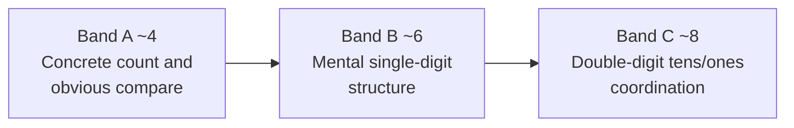

# Early Number Knowledge

## What This Reference Solves

Teachers and instructional designers must place early whole-number material when learners differ widely in readiness within the same age or grade band. This handbook answers: **for a learner near ages 4, 6, or 8 (or the corresponding primary-grade band), what number concepts, tasks, and representations are appropriate, how deep to go, and what evidence shows readiness for the next step?**

It is **material placement** for preschool through early primary whole-number sense—not a K–5 math curriculum, not a lesson plan bank, and not a substitute for standards documents.

## Coverage and Source Tradition

| Dimension | Scope |
|-----------|--------|
| **Ages** | Roughly 3–8 years; anchor points at **~4, ~6, and ~8** |
| **Grades** | Prekindergarten through grade 2 (U.S. primary framing) |
| **Domain** | Whole-number sense: counting, quantity comparison, joining/separating, number sequence, magnitude of numerals, early double-digit structure |
| **Primary tradition** | Developmental research on number knowledge and the “central conceptual structure” for whole number (Griffin & Case, summarized in *How Students Learn*, ch. 6) |
| **Supporting tradition** | K–2 cognitive and memory constraints (Ormrod); caution against isolated scope-and-sequence teaching (*How People Learn*, ch. 6) |

The developmental levels used in research (often labeled Level 0, 1, and 2 with age midpoints of 4, 6, and 8) describe **typical knowledge reorganizations**, not grade labels or fixed ceilings. Individual children commonly span **about two years** of difference within the same classroom age.

**Confidence:** **High** for the broad progression (concrete counting → mental single-digit operations → integrated structure → double-digit magnitude and operations) when grounded in the Griffin/Case line cited in *How Students Learn*. **Medium** for mapping exact calendar ages to school grades. **Low** for claiming the same milestone timing across all sociocultural and economic contexts—published norms draw heavily on middle-income populations in developed societies.

## Placement Framework (Three Bands)

Each band below states **material** (what to teach), **depth** (how far to push), **prerequisites**, **diagnostic checks** (original tasks, not a reproduced assessment protocol), **common misplacement**, and **next material**. Use bands as **hypotheses** to test with the learner, not as lockstep grade expectations.

---

### Band A — About Age 4 (Preschool; Research Level 0)

**Typical age window:** About 3–5 years (midpoint ~4).

#### Material That Fits

- **Oral counting sequence** with stable word order through at least **five** (one-to-five counting schema); many children also recite higher in the string, but coordinated counting and quantity meaning for sets are reliable mainly in this range at this band.
- **Counting small discrete sets** (about three to eight items) with one-to-one touch or point, systematic order, and **cardinality** (last count word names the set size).
- **Counting a subset** in a mixed display (e.g., only the yellow chips among red and yellow) by isolating mentally or physically, then counting.
- **Perceptual quantity comparison** for more, less, bigger, smaller when differences are visually obvious (stacks, aligned lengths, balance with clear imbalance).
- **Quantity language** in everyday contexts: a lot/little, more/less, adding and taking away in play (without requiring written symbols).

#### Depth Expected

- **Recognition and concrete manipulation:** Accurate counting and obvious comparisons; explanations may be procedural (“I counted”) rather than principled.
- **Not yet expected:** Using counting to decide which of two **close** hidden sets is larger; solving joining problems **without** objects; comparing **written numerals** for magnitude; fluent addition/subtraction facts stated in abstract form.
- **Emerging toward Band B:** Preliminary oral count toward **ten** may appear; **written numerals** and “closer to” on digits belong after oral sequence to ten is consolidated (Band B bridge).

#### Prerequisites

- Can produce counting words in order (even if imperfect beyond five).
- Can attend to a small set long enough to touch each item once.
- Understands comparison words in everyday speech (more/less) for visible quantities.

#### Diagnostic Checks (Readiness and Misunderstandings)

Use **individual, oral** tasks with manipulatives; always ask **how they know** when strategy is unclear.

| Check | What success suggests | What struggle suggests |
|-------|----------------------|------------------------|
| Count three objects placed in a row; say how many | One-to-one and cardinality for tiny sets | Word list only, or mismatch between touches and words |
| Which of two chip piles (clearly unequal) has more? Less? | Initial quantity schema for salient differences | Puzzlement at comparison language; random play with materials |
| Count only one color in a short mixed row | Can isolate a subset and count systematically | Counts all items, double-counts, or loses starting point |
| Two piles nearly equal in amount | — | Still relies on **sight**, not counting (typical at this band) |

**Partial knowledge signals:** Says counting words while touching chips but **misaligned** (extra words, skipped objects, or recounts the same chip)—knows the ritual, not the coordination rule.

#### Common Misplacement

| Error | Why it fails |
|-------|----------------|
| Introducing written numerals as the main object of instruction | Symbols lack meaning until oral counting and quantity are linked |
| Word problems requiring mental count-on without objects | Most children have not yet internalized a mental number line |
| “Which is more: 5 or 4?” with only numerals shown | Magnitude of **symbols** is harder than magnitude of **visible sets** |
| Treating failure on close comparisons as “doesn’t understand more/less” | May understand comparison only when perceptual cues suffice |

#### Next Material (After Success)

- Joining and separating stories with **small** totals (≤7) using objects or fingers.
- **Number-after** in the oral sequence (“what comes right after seven?”).
- Gradual introduction of **numerals** linked to quantities already understood orally.

**Confidence:** **High** for counting and obvious comparison; **medium** for exact upper bound on set size at age 4.

---

### Band B — About Age 6 (Kindergarten–Grade 1; Research Level 1)

**Typical age window:** About 5–7 years (midpoint ~6). **Schooling** often accelerates formal symbol use toward the end of this window.

#### Material That Fits

- **Mental counting line** for **single-digit** problems: joining sets (e.g., four and three more), **number-after** and **number-two-after**, without always needing physical chips.
- **Magnitude of numerals** (which digit is bigger/smaller) when differences are not visible as objects.
- **Closer-to** comparisons on the counting sequence (e.g., which is closer to 5: 6 or 2? which is closer to 7: 4 or 9?)—distance along the sequence, not only which digit looks larger; **visual arrays** after the question often support early success before fully mental judgments.
- **Count-on** and, less efficiently, **count-up-from-one** strategies; some children state known combinations from memory.
- **Decontextualized** addition and subtraction with small operands (e.g., two plus four, eight minus six), often with fingers allowed.
- **Written numerals** as labels for known number words and set sizes; which numeral comes **first/last** when **counting** (not merely reading left-to-right on a page).
- **Multiple representations** of the same quantity: objects, dot patterns, number-line distance, simple scales—treated as **equivalent in quantity**, not as unrelated “topics.”

#### Depth Expected

- **Routine use with explanation:** Can describe a strategy (count-on, known fact, finger tracking) for joining and sequence problems.
- **Flexible transfer emerging:** Same joining idea in different contexts (steps, time, objects) when language shifts (“how far,” “how long,” “how many”).
- **Not yet expected:** Reliable **tens-vs-ones** reasoning for double-digit comparison; counting five steps along the **decade** sequence from 49; treating column addition as a coordinated two-digit structure.

#### Prerequisites (From Band A)

- Stable counting of small sets and subset counting in mixed displays.
- Perceptual more/less for obvious differences.
- Oral sequence through at least ten with some sense that each word marks a position.

#### Diagnostic Checks

| Check | What success suggests | What struggle suggests |
|-------|----------------------|------------------------|
| “Four things, then three more—how many altogether?” (oral) | Joining via count-on or known fact; mental line | “Don’t know,” wild guess, or answer **five** (knows total should increase but not how to count) |
| “What number comes right after seven?” (lighter probe) | Knows immediate **next** word in sequence | Hesitation or unrelated number; use before two-after if sequence is fragile |
| “What number comes two after seven?” | Understands **position** in sequence, not just next word | Says “seven, eight” and stops; or “eight and nine” without choosing one |
| “Which is closer to 5: 6 or 2?” (oral; visual pairs optional) | Uses **sequence distance**, not only which numeral is larger | Picks 6 because six is bigger than two, or guesses without referencing the line |
| “Which is bigger: 7 or 9?” (no objects) | Digits have magnitude tied to sequence | Hesitant guessing (~50% without structure) |
| “How much is 2 + 4?” and “8 take away 6?” (oral, formal wording) | Decontextualized +/- with operands >3 | Needs objects; uses favorite number (e.g., five) for both |
| Show numerals out of order: which do you say **first** when counting? | Counting order separate from print layout | Picks leftmost or largest-looking numeral on the card |

**Strategy observation matters:** A child who answers seven for four-and-three may still be at Band A if they always count from one on fingers; Band B is characterized by **starting from an addend** or retrieving a fact.

#### Common Misplacement

| Error | Why it fails |
|-------|----------------|
| Double-digit computation before single-digit structure is integrated | Produces two separate one-digit operations without place-value coordination |
| Drill on written algorithms without quantity meaning | Empty procedures; errors like treating 69 vs 71 by the unit digit only appear later but roots are here |
| Skipping oral quantity work and starting worksheets | Denies the counting-word network that gives symbols meaning |
| Assuming age 6 = “should know all facts” | Many formal items at this band pass closer to **age 6–7 with instruction** |

#### Instructional Load (K–2 Constraints)

At this band, keep tasks **concrete, short, and orally supported**:

- Working memory is limited; **objects, fingers, and brief rehearsal** are legitimate scaffolds, not signs of failure.
- Connect new symbols to **prior experiences** and familiar contexts; model remembering strategies (short notes home, repeating key words) rather than assuming spontaneous rehearsal.
- Reduce visual clutter in the environment when attention to a number task is the goal—extraneous display can compete with learning for younger children.

**Confidence:** **High** for mental single-digit joining and numeral magnitude as goals; **medium** for timing of decontextualized +/- relative to calendar age vs grade placement.

#### Next Material (After Success)

- **Decade sequence** operations (what comes several after 49; several before 60).
- **Tens and ones** as coordinated dimensions (place-value language tied to quantity).
- Problems about **how many numbers lie strictly between** two values (requires treating numbers themselves as countable units).

---

### Band C — About Age 8 (Grade 2; Research Level 2)

**Typical age window:** About 7–8+ years (midpoint ~8). Some items appear late in the window or into grade 3.

#### Material That Fits

- **Double-digit sequence** reasoning: moving forward or backward along the counting sequence by **several steps** from a decade anchor.
- **Comparing two-digit numbers** using **tens first** (any number in the seventies exceeds any in the sixties, regardless of unit digit).
- **Betweenness:** How many whole numbers lie between two values (e.g., between 2 and 6 vs between 7 and 9)—requires **two coordinated number lines**.
- **Addition and subtraction** with double-digit numbers, preferably with **benchmark decomposition** (e.g., adjust to ten, then compensate) rather than only counting by ones through the forties and fifties.
- **Coordinated two dimensions** in other contexts when instruction connects (hours/minutes, dollars/cents) as the same structural idea as tens/ones.

#### Depth Expected

- **Flexible transfer:** Applies single-digit insights to tens-and-ones **when structure is recognized**.
- **Explanation:** Can articulate why tens dominate (e.g., must pass through all sixties to reach seventies).
- **Not yet the focus here:** Generalized multi-digit algorithms, fractions, or ratio—see `mathematics-grade-level-progressions.md` for later grades.

#### Prerequisites (From Band B)

- Integrated **central conceptual structure** for single digits: counting words, finger patterns, objects, and quantity language linked.
- Fluent enough single-digit joining and separating to free attention for **second dimension** (tens vs ones).

#### Diagnostic Checks

| Check | What success suggests | What struggle suggests |
|-------|----------------------|------------------------|
| Five numbers after 49 (oral) | Counts along decade sequence with tracking | Off-by-one in steps; “haven’t learned big numbers” |
| Which is bigger: 69 or 71? | Tens-based comparison | Chooses 69 because **9 > 1** (unit-digit rule) |
| How many numbers between 2 and 6? | Counts **numbers as objects** between endpoints | Says “five” because five is between, ignoring “how many” |
| 12 + 54 (oral or displayed) | Benchmark or structured composition | Counts 12 ones from 54; or adds columns as **6 and 6** without place value |

#### Common Misplacement

| Error | Why it fails |
|-------|----------------|
| Introducing standard multi-digit algorithms before tens/ones coordination | Looks like competence but masks weak structure |
| Fractions or “rules” for operations without quantity | Disconnected procedures |
| Assuming grade 2 standards mastery because age is 8 | Last items in this band (complex double-digit add/subtract) often appear **closer to 8 than 7** |

#### Next Material (After Success)

- Multi-digit addition/subtraction with **explicit place-value models** and estimation.
- Multiplication and division as **equal groups and measurement** (introduced when single- and double-digit structures are secure).
- Data and measurement contexts that use number lines and scales consistently.

**Confidence:** **High** for tens-first comparison and decade counting as placement targets; **medium** for exact age of complex double-digit mental strategies.

---

## Cross-Band Progression Summary

| Transition | Core shift | Placement lever |
|------------|------------|-----------------|
| A → B | Objects optional for small number problems | Joining and sequence without manipulatives |
| B → C | Single-digit structure → two dimensions | Tens outweigh ones; betweenness on the line |

## What “Number Sense” Means for Placement

In this tradition, **number sense** is not a checklist of tricks; it is an organized network linking:

- Counting words and their **positions** in sequence
- **Quantity** each word denotes (including transformations: join, separate, compare)
- **Strategies** when objects are absent (mental line, count-on, facts)
- **Symbols** that gain meaning from oral and object knowledge—not the reverse

Placement should prioritize **quantity and counting words** before pushing abstract symbol drills. Math is about **quantity**; numerals are tools for describing it.

## Handling Uneven and Out-of-Band Learners

| Situation | Placement guidance |
|-----------|---------------------|
| **Ahead on counting, behind on symbols** | Teach numerals by linking to known oral/set meanings; do not skip quantity |
| **Ahead on procedures, weak on comparison language** | Step back to oral magnitude and “closer to” tasks before harder computation |
| **Age-grade match but low band performance** | Teach at **demonstrated band**; use age only as a first guess |
| **High band on oral tasks, low on written** | Separate **symbol placement** from **number-structure placement** |
| **English learners** | Distinguish **number concept** from **comparison vocabulary** in English; oral tasks in a familiar language may show higher band |

Formal **grade-level objectives** from standards documents may list topics earlier than typical developmental readiness. Resolve conflicts by **diagnostic evidence**, not age alone.

## Misuse and Overclaim Warnings

- **Do not** treat age midpoints (4, 6, 8) as grade cut scores or retention criteria.
- **Do not** use a single score on any fixed item list without probing **strategy and reasoning** (oral administration; follow-up “how did you figure that out?” on key items).
- **Do not** infer lack of intelligence from Band A behaviors—many responses reflect **uncoordinated** counting and quantity schemas, not absence of ability.
- **Do not** replace a full math program with this handbook; it does not specify pacing, standards alignment, or assessment systems.
- **Do not** assume research norms apply equally to all communities; validate with local classroom evidence.

## Relationships to Adjacent References

| Reference | Relationship |
|-----------|----------------|
| `early-childhood-foundations.md` | Broader preschool readiness (language, attention, play)—feeds prerequisites for Band A |
| `mathematics-grade-level-progressions.md` | Later grades and wider math domains beyond early whole number |
| `grade-band-material-leveling.md` | General cross-subject depth for primary bands |
| `developmental-readiness-prerequisites.md` | ZPD, scaffolding, and readiness across domains |
| `scope-sequence-limits.md` | Why isolated scope-and-sequence charts fail to build connected number knowledge |

## Design Implications (Placement Only)

When selecting **tasks and representations** for a band:

- **Band A:** Object-based representations: real items and pictures; comparison with visible difference.
- **Band B:** Bridge to mental operations; introduce numerals and simple number lines once oral sequence to ~10 is consolidated.
- **Band C:** Number lines and structured tens/ones models; problems that require **both** dimensions at once.

Moving among object, picture, line, and scale representations **within** a band supports transfer; jumping to formal symbols without oral quantity networks is a common misplacement.
